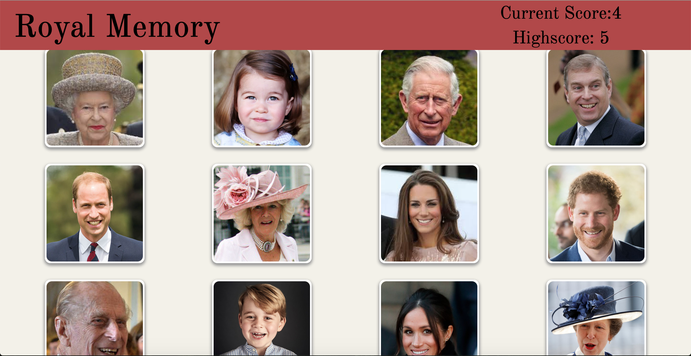

# Royal Family Clicky Game

# Description

Application designed to test the users memory of the Royal Family. Players will be challenged to try to click on each member of the Royal Family once without selecting the same member twice. Images will be randomly mixed up each time a correct image has been clicked.  

# Technologies Used

- React
- Javascript
- JQuery
- CSS
- Bootstrap

# Instructions Page

# Gameplay

